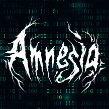

<h2 align="center">Hi :wave:! Welcome to Cristian Cerami's profile!</h2>

I'm a Master's Degree Student of Cybersecurity at DMI UniPg, Italy, that love programming in Python.

Currently, most of the repositories you can see are exam projects from the last 4 years, so sorry if "something" :joy: is poorly written!

###

  
  

###

<table>
  <tr>
    <td rowspan="3"></td>
    <td>
      
      
    </td>
  </tr>
  <tr>
    <td>
  
  
  
  
  
  
  
  
  
  
  
  
  
  
  
  
  
  
  
  
  
  
  
  
  
  
  
    </td>
  </tr>
  <tr>
    <td>
  
  
  
    </td>
  </tr>
</table>
